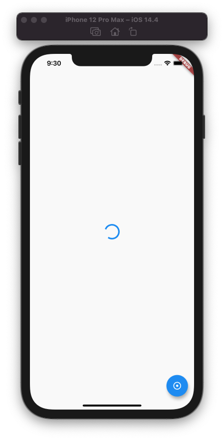
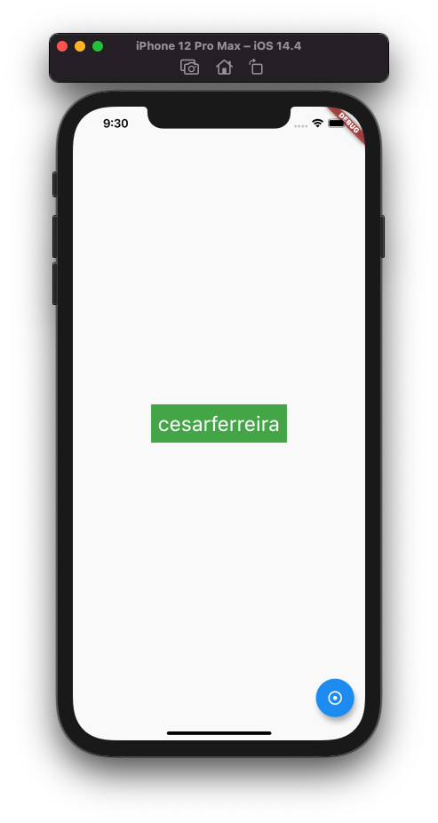
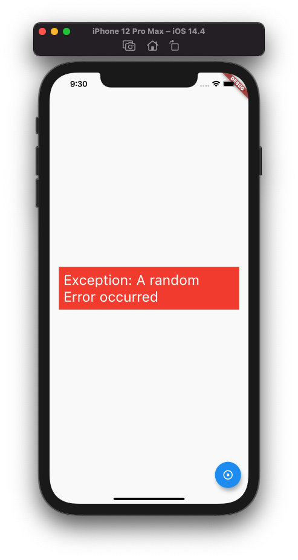

# UIState

> Cleanest way of representing UI state in a flutter widget.


Loading                    |         Success           |           Failure      |
:-------------------------:|:-------------------------:|:----------------------:|
  |   | 

## Usage

Get a live/stream representation of your data:

```dart
UIState<String> state = Provider.of<ViewModel>(context).state;
```

Inspired by kotlin's inline switch:

The `when` returns the widget of the current state of your `state` variable


```dart
state.when(
    success: (event) => successWidget(event.value),
    failure: (event) => failureWidget(event.errorMessage),
    loading: (event) => loadingSpinner(),
)
```


## `build` method example:

```dart
@override
  Widget build(BuildContext context) {
    UIState<String> state = Provider.of<ViewModel>(context).state;

    return Scaffold(
      body: Container(
        margin: EdgeInsets.all(20),
        child: Center(
          child: state.when(
            success: (event) => successWidget(event.value),
            failure: (event) => failureWidget(event.errorMessage),
            loading: (event) => loadingSpinner(),
          ),
        ),
      ),
      floatingActionButton: FloatingActionButton(
        child: Icon(Icons.adjust_sharp),
        onPressed: () {
          Provider.of<ViewModel>(context, listen: false).fetchUser();
        },
      ),
    );
  }
```


## The `ChangeNotifier` (ViewModel) side of it

The `state` variable will assume the loading/failure/success state of the data request:

```dart
class ViewModel extends ChangeNotifier {
  final UsernameRepository repository;
  ViewModel(this.repository);

  UIState<String> state = Loading();

  fetchUser() async {
    try {
      String username = await repository.getUsername();
      state = Success(username);
    } catch (error) {
      state = Failure(error.toString());
    }

    notifyListeners();
  }
}
```


---------------------


Made with ♥ by [Cesar Ferreira](http://cesarferreira.com)
